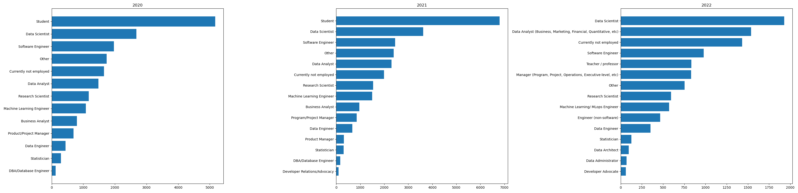
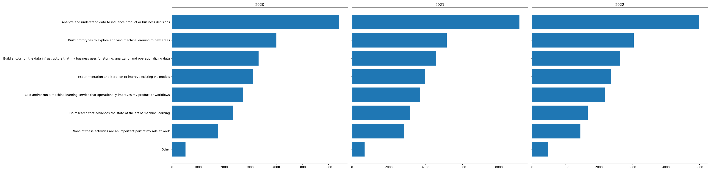
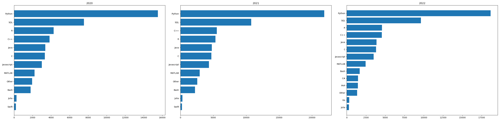
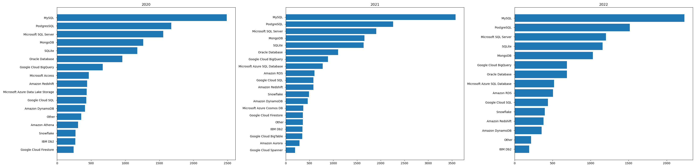
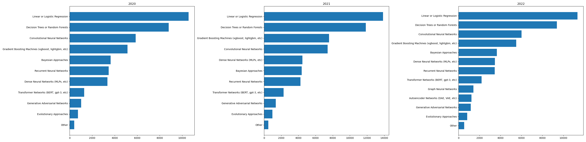

# Project 3: Toolbox of a Data Scientist  
## Introduction  
This project, “Toolbox of a Data Scientist,” explores the Kaggle Machine Learning and Data Science Survey datasets from 2020, 2021, and 2022, published by [kaggle.com](https://www.kaggle.com). We perform a longitudinal analysis on the survey results to answer three essential questions for aspiring data scientists:  
1. What job titles do data scientists typically hold?  
2. What are their daily job responsibilities?  
3. What skills and tools do they use most frequently?  
4. What machine learning tools and frameworks do they commonly use? 
We use `pandas` and `sqlite3` to construct the database, and visualize trends with `matplotlib`.  

## 📦 Download Dataset

Due to GitHub file size limitations, the dataset is hosted externally.

👉 [Click here to download the `data/` folder (Google Drive)](https://drive.google.com/file/d/1_Kh8LCyPAidmX_VoYZp5RA537ubEPh5V/view?usp=sharing)

## ⚙️ How to Reproduce  
- Install [Miniconda](https://docs.anaconda.com/miniconda)  
- Create the environment from `environment.yml`:  
```bash  
conda env create -f environment.yml  
```  
- Place the following CSV files into the `data/` folder:  
  `kaggle_survey_2020_responses.csv`,  
  `kaggle_survey_2021_responses.csv`,  
  `kaggle_survey_2022_responses.csv`  
- Activate the environment and run the following script to build the SQLite database:  
```bash  
python create_kaggle_survey_db.py  
```  
- Then run the plotting script to generate six horizontal bar charts:  
```bash  
python create_longitudinal_analysis_plots.py  
```  
### What job titles do data scientists typically hold?  
Data scientist, Data analyst, Software engineer, ...etc.  
  

### What are the daily job responsibilities of a data scientist?  
Analyze and understand data to influence product or business decisions.  
  

### What skills and tools are required to become a data scientist?    
Programming languages: Python, SQL, R, C++, ...etc. 
  
  
  
  


## 📁 Project Structure  
```
DATA_SCIENTISTS_TOOLBOX/
├── data/
│   ├── kaggle_survey_2020_answer_choices.pdf
│   ├── kaggle_survey_2020_responses.csv
│   ├── kaggle_survey_2021_answer_choices.pdf
│   ├── kaggle_survey_2021_responses.csv
│   ├── kaggle_survey_2022_answer_choices.pdf
│   ├── kaggle_survey_2022_responses.csv
│   └── kaggle_survey.db
├── create_kaggle_survey_db.py
├── create_longitudinal_analysis_plots.py
├── data_science_job_databases.png
├── data_science_job_machine_learnings.png
├── data_science_job_programming_languages.png
├── data_science_job_tasks.png
├── data_science_job_titles.png
├── environment.yml
└── README.md
```

## 📊 Output Visualizations  
- `data_science_job_titles.png`: Yearly comparison of job titles  
- `data_science_job_tasks.png`: Daily tasks of data scientists (shared y-axis for consistent comparison across years)  
- `data_science_job_programming_languages.png`: Most used programming languages  
- `data_science_job_databases.png`: Most used database systems  
- `data_science_job_machine_learnings.png`: Popular ML tools and platforms  

## 🧪 Environment Setup (environment.yml)  
```yaml  
name: data_scientists_toolbox  
channels:  
  - conda-forge  
dependencies:  
  - python=3.12  
  - pandas=2.3.1  
  - matplotlib=3.10.0  
  - numpy=2.0.1  
  - sqlite=3.50.2  
```
